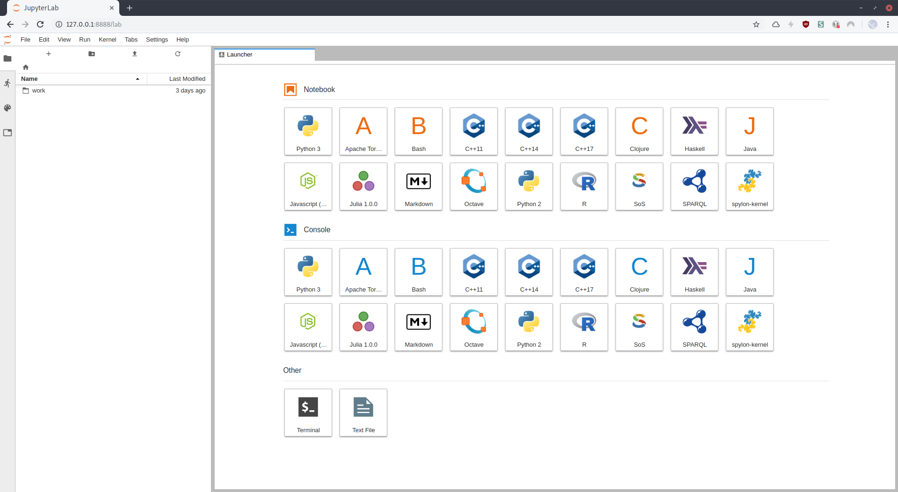

# Jupyter Docker Pack

Combination of a `Dockerfile`s of official Jupyter images and SoS image with extra kernels installed.

 * [jupyter/all-spark-notebook](https://github.com/jupyter/docker-stacks/blob/master/all-spark-notebook) image as basis (Python, R, Spark, Scala via Apache Toree)
 * [jupyter/datascience-notebook](https://github.com/jupyter/docker-stacks/blob/master/datascience-notebook) `Dockerfile` content appended (Julia, R libraries)
 * [jupyter/tensorflow-notebook](https://github.com/jupyter/docker-stacks/blob/master/tensorflow-notebook) `Dockerfile` content appended (Tensorflow libraries)
 * [jupyter/r-notebook](https://github.com/jupyter/docker-stacks/blob/master/r-notebook) `Dockerfile` content appended (R libraries)
 * [vatlab/SoS docker-notebook](https://github.com/vatlab/SoS/blob/master/development/docker-notebook) `Dockerfile` content appended (SoS, Bash, JavaScript)
 * [xeus-cling]() kernel installed (C++)
 * [ihaskell]() kernel installed (Haskell)
 * [ijava]() kernel installed (Java)
 * [clojupyter]() kernel installed (Clojure)
 * [iruby]() kernel installed (Ruby)

## Usage

Since it is derived from `jupyter/all-spark-notebook` [all instructions relevant to jupyter images](https://jupyter-docker-stacks.readthedocs.io/en/latest/) should work.
The only change would be image name (`kubuszok/jupyter-pack`).

    docker run --rm -p 8888:8888 -e JUPYTER_ENABLE_LAB=yes -v "$PWD":/home/jovyan/work kubuszok/jupyter-pack
